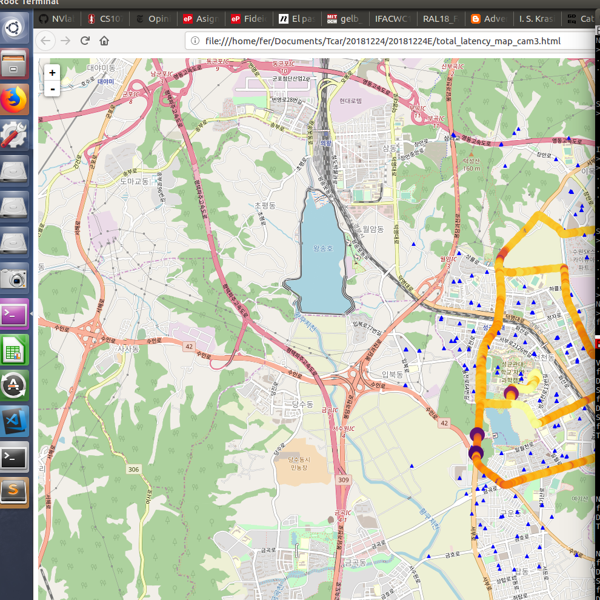

## Experiment Date: {date}
## Experiment Name: {name}
 <table></table>

### Route

### Experiment

- Experiment Conditions
    - frame size : {video_res}
    - 30 fps
    - lte connection
    - gop : 1
    - place : {place}

<!-- pagebreak -->

- Experiment Results

### Encoding Latency

|camera num|min|max|avg|std|
|---|---|---|---|---|
|All|{Encoding Latency All Cameras_min:.2f}|{Encoding Latency All Cameras_max:.2f}|{Encoding Latency All Cameras_avg:.2f}|{Encoding Latency All Cameras_std:.2f}|
|0|{Camera 0 Encoding Latency_min:.2f}|{Camera 0 Encoding Latency_max:.2f}|{Camera 0 Encoding Latency_avg:.2f}|{Camera 0 Encoding Latency_std:.2f}|
|1|{Camera 1 Encoding Latency_min:.2f}|{Camera 1 Encoding Latency_max:.2f}|{Camera 1 Encoding Latency_avg:.2f}|{Camera 1 Encoding Latency_std:.2f}|
|2|{Camera 2 Encoding Latency_min:.2f}|{Camera 2 Encoding Latency_max:.2f}|{Camera 2 Encoding Latency_avg:.2f}|{Camera 2 Encoding Latency_std:.2f}|
|3|{Camera 3 Encoding Latency_min:.2f}|{Camera 3 Encoding Latency_max:.2f}|{Camera 3 Encoding Latency_avg:.2f}|{Camera 3 Encoding Latency_std:.2f}|
|4|{Camera 4 Encoding Latency_min:.2f}|{Camera 4 Encoding Latency_max:.2f}|{Camera 4 Encoding Latency_avg:.2f}|{Camera 4 Encoding Latency_std:.2f}|
|5|{Camera 5 Encoding Latency_min:.2f}|{Camera 5 Encoding Latency_max:.2f}|{Camera 5 Encoding Latency_avg:.2f}|{Camera 5 Encoding Latency_std:.2f}| 
<!-- pagebreak -->

### Network Latency

|camera num|min|max|avg|std|
|---|---|---|---|---|
|All|{Network Latency All Cameras_min:.2f}|{Network Latency All Cameras_max:.2f}|{Network Latency All Cameras_avg:.2f}|{Network Latency All Cameras_std:.2f}|
|0|{Camera 0 Network Latency_min:.2f}|{Camera 0 Network Latency_max:.2f}|{Camera 0 Network Latency_avg:.2f}|{Camera 0 Network Latency_std:.2f}|
|1|{Camera 1 Network Latency_min:.2f}|{Camera 1 Network Latency_max:.2f}|{Camera 1 Network Latency_avg:.2f}|{Camera 1 Network Latency_std:.2f}|
|2|{Camera 2 Network Latency_min:.2f}|{Camera 2 Network Latency_max:.2f}|{Camera 2 Network Latency_avg:.2f}|{Camera 2 Network Latency_std:.2f}|
|3|{Camera 3 Network Latency_min:.2f}|{Camera 3 Network Latency_max:.2f}|{Camera 3 Network Latency_avg:.2f}|{Camera 3 Network Latency_std:.2f}|
|4|{Camera 4 Network Latency_min:.2f}|{Camera 4 Network Latency_max:.2f}|{Camera 4 Network Latency_avg:.2f}|{Camera 4 Network Latency_std:.2f}|
|5|{Camera 5 Network Latency_min:.2f}|{Camera 5 Network Latency_max:.2f}|{Camera 5 Network Latency_avg:.2f}|{Camera 5 Network Latency_std:.2f}| 
<!-- pagebreak -->

### Total Latency

|camera num|min|max|avg|std|
|---|---|---|---|---|
|All|{Total Latency All Cameras_min:.2f}|{Total Latency All Cameras_max:.2f}|{Total Latency All Cameras_avg:.2f}|{Total Latency All Cameras_std:.2f}|
|0|{Camera 0 Total Latency_min:.2f}|{Camera 0 Total Latency_max:.2f}|{Camera 0 Total Latency_avg:.2f}|{Camera 0 Total Latency_std:.2f}|
|1|{Camera 1 Total Latency_min:.2f}|{Camera 1 Total Latency_max:.2f}|{Camera 1 Total Latency_avg:.2f}|{Camera 1 Total Latency_std:.2f}|
|2|{Camera 2 Total Latency_min:.2f}|{Camera 2 Total Latency_max:.2f}|{Camera 2 Total Latency_avg:.2f}|{Camera 2 Total Latency_std:.2f}|
|3|{Camera 3 Total Latency_min:.2f}|{Camera 3 Total Latency_max:.2f}|{Camera 3 Total Latency_avg:.2f}|{Camera 3 Total Latency_std:.2f}|
|4|{Camera 4 Total Latency_min:.2f}|{Camera 4 Total Latency_max:.2f}|{Camera 4 Total Latency_avg:.2f}|{Camera 4 Total Latency_std:.2f}|
|5|{Camera 5 Total Latency_min:.2f}|{Camera 5 Total Latency_max:.2f}|{Camera 5 Total Latency_avg:.2f}|{Camera 5 Total Latency_std:.2f}| 

<!-- pagebreak -->
### Offset GPS Streamer

|camera num|min|max|avg|std|
|---|---|---|---|---|
|All|{Offset GPS Streamer All Cameras_min:.2f}|{Offset GPS Streamer All Cameras_max:.2f}|{Offset GPS Streamer All Cameras_avg:.2f}|{Offset GPS Streamer All Cameras_std:.2f}|
|0|{Camera 0 Offset GPS Streamer_min:.2f}|{Camera 0 Offset GPS Streamer_max:.2f}|{Camera 0 Offset GPS Streamer_avg:.2f}|{Camera 0 Offset GPS Streamer_std:.2f}|
|1|{Camera 1 Offset GPS Streamer_min:.2f}|{Camera 1 Offset GPS Streamer_max:.2f}|{Camera 1 Offset GPS Streamer_avg:.2f}|{Camera 1 Offset GPS Streamer_std:.2f}|
|2|{Camera 2 Offset GPS Streamer_min:.2f}|{Camera 2 Offset GPS Streamer_max:.2f}|{Camera 2 Offset GPS Streamer_avg:.2f}|{Camera 2 Offset GPS Streamer_std:.2f}|
|3|{Camera 3 Offset GPS Streamer_min:.2f}|{Camera 3 Offset GPS Streamer_max:.2f}|{Camera 3 Offset GPS Streamer_avg:.2f}|{Camera 3 Offset GPS Streamer_std:.2f}|
|4|{Camera 4 Offset GPS Streamer_min:.2f}|{Camera 4 Offset GPS Streamer_max:.2f}|{Camera 4 Offset GPS Streamer_avg:.2f}|{Camera 4 Offset GPS Streamer_std:.2f}|
|5|{Camera 5 Offset GPS Streamer_min:.2f}|{Camera 5 Offset GPS Streamer_max:.2f}|{Camera 5 Offset GPS Streamer_avg:.2f}|{Camera 5 Offset GPS Streamer_std:.2f}| 

<!-- pagebreak -->
### Offset GPS Player

|camera num|min|max|avg|std|
|---|---|---|---|---|
|All|{Offset GPS Player All Cameras_min:.2f}|{Offset GPS Player All Cameras_max:.2f}|{Offset GPS Player All Cameras_avg:.2f}|{Offset GPS Player All Cameras_std:.2f}|
|0|{Camera 0 Offset GPS Player_min:.2f}|{Camera 0 Offset GPS Player_max:.2f}|{Camera 0 Offset GPS Player_avg:.2f}|{Camera 0 Offset GPS Player_std:.2f}|
|1|{Camera 1 Offset GPS Player_min:.2f}|{Camera 1 Offset GPS Player_max:.2f}|{Camera 1 Offset GPS Player_avg:.2f}|{Camera 1 Offset GPS Player_std:.2f}|
|2|{Camera 2 Offset GPS Player_min:.2f}|{Camera 2 Offset GPS Player_max:.2f}|{Camera 2 Offset GPS Player_avg:.2f}|{Camera 2 Offset GPS Player_std:.2f}|
|3|{Camera 3 Offset GPS Player_min:.2f}|{Camera 3 Offset GPS Player_max:.2f}|{Camera 3 Offset GPS Player_avg:.2f}|{Camera 3 Offset GPS Player_std:.2f}|
|4|{Camera 4 Offset GPS Player_min:.2f}|{Camera 4 Offset GPS Player_max:.2f}|{Camera 4 Offset GPS Player_avg:.2f}|{Camera 4 Offset GPS Player_std:.2f}|
|5|{Camera 5 Offset GPS Player_min:.2f}|{Camera 5 Offset GPS Player_max:.2f}|{Camera 5 Offset GPS Player_avg:.2f}|{Camera 5 Offset GPS Player_std:.2f}| 

<!-- pagebreak -->
### Encoding Latency

<!-- pagebreak -->
### Encoding Latency Histograms

<!-- pagebreak -->
### Network Latency 

<!-- pagebreak -->
### Network Latency Histogram

<!-- pagebreak -->

# Total Latency

<!-- pagebreak -->
# Total Latency Histogram

<!-- pagebreak -->

# Offset GPS Streamer

<!-- pagebreak -->
# Offset GPS Streamer Histogram

<!-- pagebreak -->

# Offset GPS Player

<!-- pagebreak -->
# Offset GPS Player Histogram

<!-- pagebreak -->

### Satellite Count 

<!-- pagebreak -->

## Encoding Latency over Route

### Encoding Latency for all cameras
Map | Index
:-------------------------:|:-------------------------:
  | 
### Encoding Latency Camera 0
Map | Index
:-------------------------:|:-------------------------:
  | 
<!-- pagebreak -->
### Encoding Latency Camera 1
Map | Index
:-------------------------:|:-------------------------:
  | 
### Encoding Latency Camera 2
Map | Index
:-------------------------:|:-------------------------:
  |  
<!-- pagebreak -->
### Encoding Latency Camera 3
Map | Index
:-------------------------:|:-------------------------:
  |  
### Encoding Latency Camera 4
Map | Index
:-------------------------:|:-------------------------:
  |  
### Encoding Latency Camera 5
Map | Index
:-------------------------:|:-------------------------:
  |  

<!-- pagebreak -->

## Network Latency over Route

### Network Latency for all cameras
Map | Index
:-------------------------:|:-------------------------:
  | 
### Network Latency Camera 0
Map | Index
:-------------------------:|:-------------------------:
  | 
<!-- pagebreak -->
### Network Latency Camera 1
Map | Index
:-------------------------:|:-------------------------:
  | 
### Network Latency Camera 2
Map | Index
:-------------------------:|:-------------------------:
  |  
<!-- pagebreak -->
### Network Latency Camera 3
Map | Index
:-------------------------:|:-------------------------:
  |  
### Network Latency Camera 4
Map | Index
:-------------------------:|:-------------------------:
  |  
### Network Latency Camera 5
Map | Index
:-------------------------:|:-------------------------:
  |  

<!-- pagebreak -->

### Total Latency for all cameras

Map | Index
:-------------------------:|:-------------------------:
  | 
### Total Latency Camera 0
Map | Index
:-------------------------:|:-------------------------:
  | 
<!-- pagebreak -->
### Total Latency Camera 1
Map | Index
:-------------------------:|:-------------------------:
  | 
### Total Latency Camera 2
Map | Index
:-------------------------:|:-------------------------:
  |  
<!-- pagebreak -->
### Total Latency Camera 3
Map | Index
:-------------------------:|:-------------------------:
  |  
### Total Latency Camera 4
Map | Index
:-------------------------:|:-------------------------:
  |  
### Total Latency Camera 5
Map | Index
:-------------------------:|:-------------------------:
  |  

<!-- pagebreak -->
### GPS Satellite Count Map
Map | Index
:-------------------------:|:-------------------------:
  | 

<!-- pagebreak -->
### Total Latency, Speed vs Time

### Total Latency vs Speed

### Total Latency vs Speed Histogram

<!-- pagebreak -->
### Total Latency vs Antennas inside various radii

